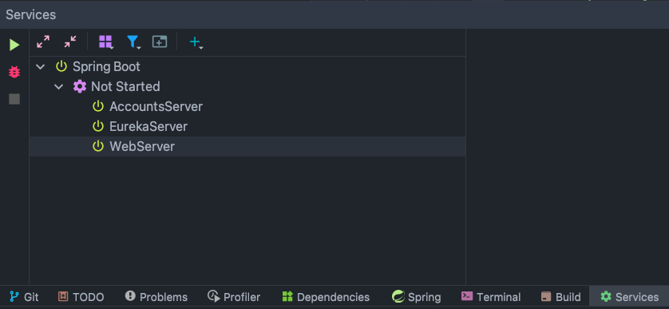
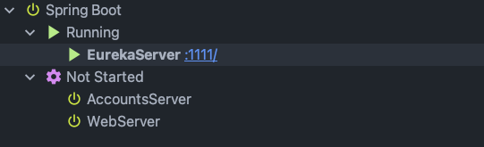
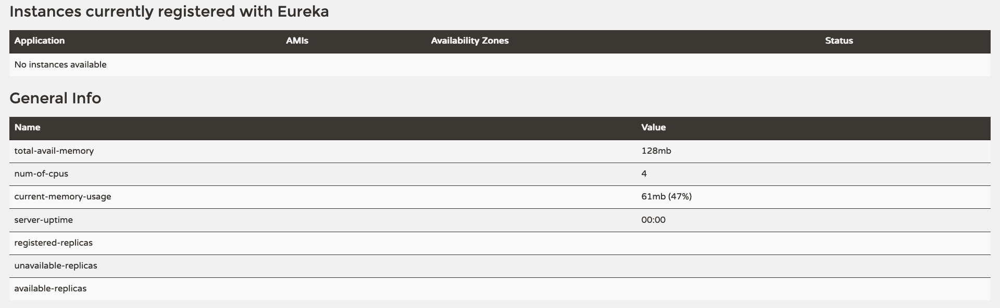
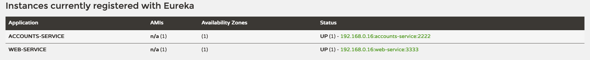
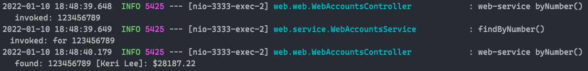
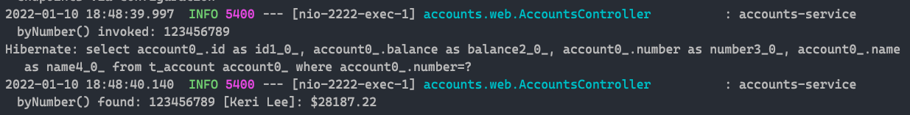
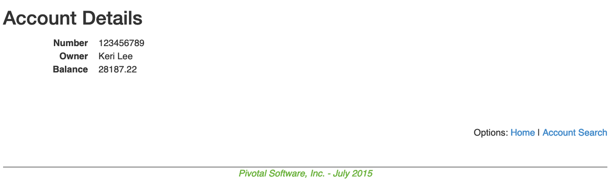

# Microservice architecture description

We have an example of [Eureka](https://github.com/Netflix/eureka) 
service, which grants a server for microservices discovery in a 
microservice architecture.

These microservices already know which Eureka server has been configured
for them, so the can register their services in order to communicate
to other microservices in the network when they start up.

There are two microservices in this example that register and communicates
with each other through Eureka server. Both of them are marked as Eureka
clients by the Spring Boot notation `@EurekaClient` (under 
`accounts/src/main/kotlin/Application.kt` and `web/src/main/java/web/WebServer.kt`).
The web microservice acts as an MVC frontend and the accounts' 
microservice contains information about some people accounts stored
in a database, which shares through a public RESTApi.

## Microservices execution

In order to execute the microservices, the Eureka server must be
initialized first and the other microservices are initialized later on.

```bash
./gradlew :registration:bootRun
./gradlew :accounts:bootRun
./gradlew :web:bootRun
```

Spring boot automatically detects these three services and the can be
initialized as shown bellow.



## Service discovery and registration

Once Eureka server is initialized, it will be available at 
`localhost:1111`.



If we go to that URI, a dashboard is shown, where thereis is
information about the system, microservices registered and available,
general information and more.



For now, the microservices haven't been initialized yet. Let's start
them up, so they are registered in Eureka. This is made automatically
if the lines bellow are specified under `**/resources/application.yml`.

```yaml
# Discovery Server Access
eureka:
  client:
    serviceUrl:
      defaultZone: http://localhost:1111/eureka/
```

When they are ready, they will show under the “Instance currently registered
with” Eureka option in the dashboard.



The name given to the microservice in Eureka is also configured
in the `application.yaml`.

```yaml
spring:
  application:
    name: accounts-service  # Identify this application
```

## Services communication

Now that microservices are registered in Eureka server with a name,
Spring Boot will configure a restTemplate automatically in a
transparent way just through the microservice name which it wants
to communicate with.

In the configuration bellow under 
`web/src/main/java/web/config/WebServerConfiguration.kt` is shown.

```kotlin
@Configuration
public class WebServerConfiguration {
    /**
     * URL uses the logical name of account-service - upper or lower case,
     * doesn't matter.
     */
    private static final String ACCOUNTS_SERVICE_URL = "http://ACCOUNTS-SERVICE";

    /**
     * The AccountService encapsulates the interaction with the micro-service.
     *
     * @return A new service instance.
     */
    @Bean
    public WebAccountsService accountsService() {
        return new WebAccountsService(ACCOUNTS_SERVICE_URL, restTemplate());
    }

    /**
     * Load balancing from the client side to discover the best Eureka server
     */
    @LoadBalanced
    @Bean
    public RestTemplate restTemplate() {
        return new RestTemplate();
    }
}
```

For example, when a petition of a concrete account information is 
made, the web server will ask the accounts service for the information,
and it will answer correctly.

Webserver request a specific account.



Accounts service receives the request, process it and send a reply back.



Result is display in the web server.




## Client load balancing thanks to Eureka

As a curiosity, there is 
[client load balancing](https://spring.io/guides/gs/spring-cloud-loadbalancer/) configured under 
`web/src/main/java/web/config/WebServerConfiguration.kt`, just 
to discover the nearest access point in the network.

```kotlin
/**
 * Load balancing from the client side to discover the best Eureka server
 */
@LoadBalanced
@Bean
public RestTemplate restTemplate() {
    return new RestTemplate();
}
```
